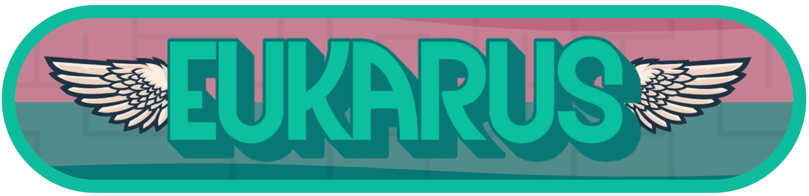
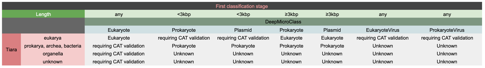
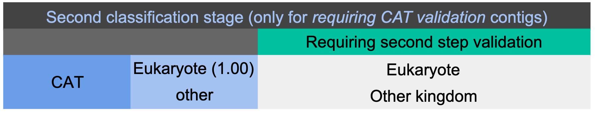

This repository contains a Nextflow pipeline that allows eukaryotic contigs to be isolated from assemblies.

## Requirements

The current prerequisites are Singularity and the tool images of [Tiara](https://github.com/ibe-uw/tiara), [DeepMicroClass](https://github.com/chengsly/DeepMicroClass/tree/master) and [CAT](https://github.com/MGXlab/CAT_pack). 

## Usage

To easily test this pipeline, you can use the predefinied test use case :

    nextflow run main.nf -profile test,ebi_slurm

For practical cases, you can run its current version like this :

    nextflow run main.nf -profile ebi_slurm --contigsPath {pathToFasta}

For non-EBI users, note that you'll need to create your own profile and associated config file in order to precise the container paths and versions. 

## Settings

Note that you can specify the [DeepMicroClass](https://github.com/chengsly/DeepMicroClass/tree/master) parameters by adding these when running the nextflow script :

    nextflow run main.nf -profile ebi_slurm --contigsPath {pathToFasta} --model {path} --encoding {onehot,embedding} --mode {hybrid,single} --singleLen {n} --device {cpu,cuda}

By default, the model contained in the Singularity image `deepmicroclass.sif` is used.

In addition, although it is possible to specify the use of CUDA, please first check that the used image corresponds to the GPU version of DeepMicroClass.

## Decisions rules

This pipeline use the following decision rules to classify the contigs :

The final fasta `other_kingdoms.fa` includes the contigs not classified as eukaryotes by CAT and the contigs not classified as eukaryotes during the first classification stage.

## Pipeline directed acyclic graph

